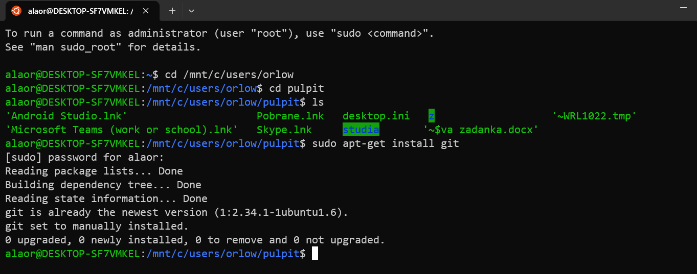
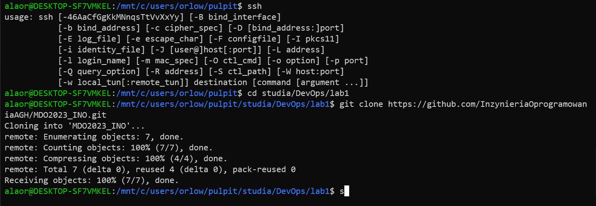
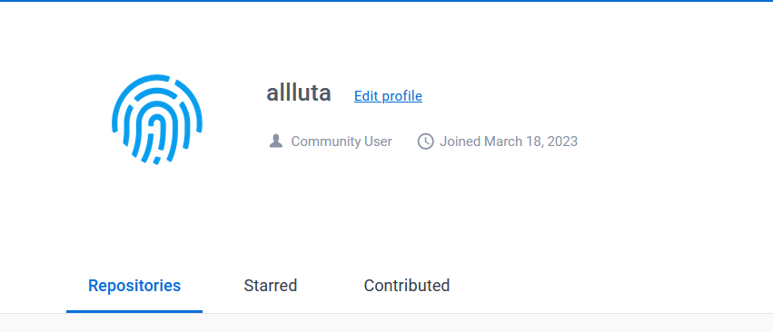
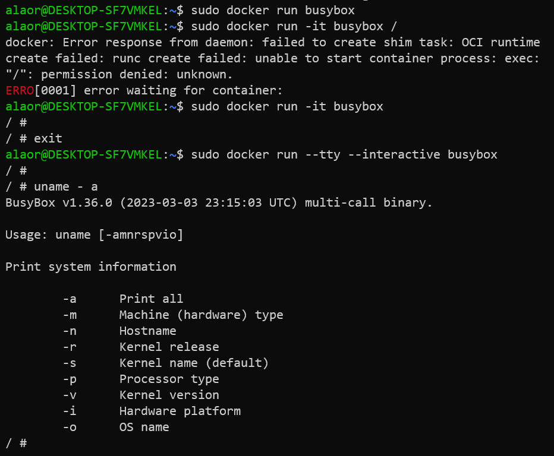
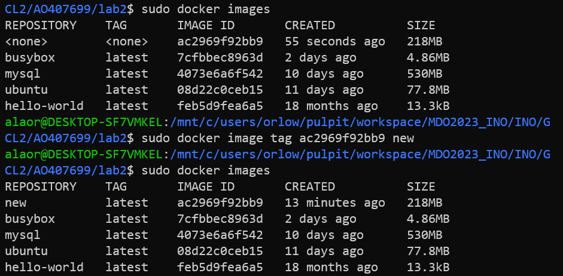

Alicja Orłowicz
# SPRAWOZDANIE LABORATORIUM 1: WPROWADZENIE , GIT, GAŁĘZIE, SSH

[1] Zainstalowano klienta Git i obsługę kluczy SSH.

)

[2] Sklonowano repozytorium  za pomocą HTTPS.

[3] Utworzono dwa klucze SSH, inne niż RSA, w tym co najmniej jeden zabezpieczony hasłem.

[4] Skonfigurowano klucz SSH jako metodę dostępu do GitHuba

[5]Sklonowano repozytorium z wykorzystaniem protokołu SSH

niestety tego kroku nie uwieczniłam na ss

[6]Przełączono się na gałąź main, a następnie gałąź swojej grupy – GCL2.
Utworzono gałąź o nazwie AO407699 i przełączono się na nią. Następnie rozpoczęto pracę na nowej gałęzi.

 

[7]Rozpoczęto pracę nad Git Hookiem -utworzono nowy plik i zedytowano. Napisanie Git Hook'a polegało na tym, by weryfikował każdy commit message -  czy zaczyna sie od moich inicjałów oraz numeru indeksu, czyli AO407699. Następnie plik skopiowano do odpowiedniego katalogu.

[8] Przetestowano poprawność działania Git-Hooka – można zauwazyć na zrzucie ekranu, że działa poprawnie.

[9] Dodano sprawozdanie oraz screeny do katalogu.

[10] Wyciągnieto gałąź do gałęzi grupowej.

[11] Zmodyfikowano sprawozdanie o dalsze kroki oraz ponowne wypchnięto gałąź.

# SPRAWOZDANIE LABORATORIUM 2: GIT, DOCKER 

[1] Zainstalowano dockera oraz sprawdzono jego wersję.

[2] Zarejestrowano się w Docker Hub i zapoznano z sugerowanymi obrazami.

[3] Następnie pobrałam hello-world, busybox, ubuntu i mysql.

[4] Po pobraniu hello-world sprawdzono czy instalacja się powiodła. Mozna zauważyć na zrzucie ekranu, że tak.

[5]Wyświetlono dostępne zainstalowane przez nas obrazy.

[6] Kolejnym krokiem było uruchomienie busyboxa, interaktywne podłączenie się do niego, a takze jego wersja

[7] Uruchomiono Ubuntu, sprawdzono PID1 i procesy dockera oraz zaaktualizowano pakiety.

[8] Stworzono własnoręcznie, zbudowano i uruchomiono prosty plik Dockerfile bazujący na wybranym systemie.

[9] Zmieniono nazwę w celu ułatwienia pracy.

[10] Upewniono się, czy sklonowano repozytorium.

[11] Następnie w drugim terminalu sprawdzono uruchomione kontenery.

[12] Usunięto uruchomione kontenery poleceniem. Aby się upewnić, czy poprawnie usunęłam, listowałam uruchamiane kontenery.

[13] Wyczyszczono wszystkie obrazy.

