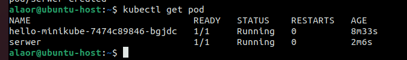
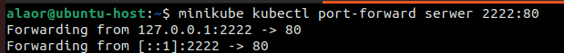
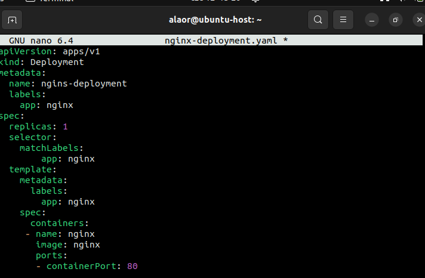

## Sprawozdanie 5

Alicja Orłowicz, 407699

## Instalacja klastra Kubernetes

Implementacja stosu k8s:minikube wedle oficjalnej dokumentacji (https://minikube.sigs.k8s.io/docs/start/) wraz z sprawdzeniem statusu klastra lokalnego:

Instalacja kubectl wedle oficjalnej dokumentacji (https://kubernetes.io/docs/tasks/tools/install-kubectl-linux#install-kubectl-binary-with-curl-on-linux):

Kluster minikube postawiony, kubectl można również pobrać używając:

Wylistowanie działajacych kontenerów/workerów działających na lokalnym klastrze - wszystko działa poprawnie : 

Uruchomienie dashboarda w przeglądarce domyślnej systemu, łączność odbywa się na localhoście na porcie 39285:

Utworzenie przykładowych wdrożeń.

Pobranie gotowego obrazu nginx:stable :

Uruchomienie kontenera :

Włączenie obsługi deploymentu kubectl get services hello-minikube. Przekierowanie na port :

### Wdrożenie
 Utworzenie pliku .yaml za pomocą polecenia 'touch nginx-deployment.yaml'
  Zawartość pliku: 

Sprawdzono rezultaty przy pomocy kubectl get pods oraz Dashboarda minikube:

Wszystko działa poprawnie i zgodnie.

## Wdrażanie na zarządzalne kontenery: Kubernetes (2)

Konwersja wdrożenia ręcznego na wdrożenie deklaratywne YAML

Wzbogacono obraz o 4 repliki:

Rozpoczęto wdrożenie za pomocą kubectl apply i zbadano stan za pomocą kubectl rollout status :

Przygotowanie nowego obrazu

Pobranie innej, starszej wersji obrazu nginx :

Zmiany w deploymencie

Zaktualizowanie pliku YAML z wdrożeniem i przeprowadzenie  ponownie po zastosowaniu zmian.
Zmniejszenie liczby replik do 1.

Zmniejszenie liczby replik do 0:

Zastosowanie starszej wersji:

Przywrócenie poprzednicj wersji wdrożeń za pomocą poleceń kubectl rollout history i kubectl rollout undo :

Kontrola wdrożenia

Napisanie skryptu weryfikującego, czy wdrożenie „zdążyło” się wdrożyć (60 sekund). 

### Strategie wdrożenia

Recreate kończy dziąłanie nieaktualnych instancji i uruchamia je w nowszej wersji, zapewnia ciągłość odnawiania stanu aplikacji.

Pody są niszczone.

Rolling Update umożliwia stopniową aktualizację. Liczba podów ze starszą wersją jest zmniejsza a z nową wersją zwiększana. Istotnymi argumetami są: maxSurge – liczba podów, które możemy dodać,  maxUnvailable – liczba podów nieaktywnych

Canary Deployment workload opiera się na wdrożeniu nowego oprogramowania obok starszych wersji, które są stabilne. Wraz z nowym wdrożeniem umożliwia zwiększenie podów i rezygnację ze starych.

Dobór odpowiedniej strategii wdrażania zależy od konkretnych wymagań i kontekstu projektu. Istnieje kilka czynników, które warto wziąć pod uwagę.

Pierwszym aspektem do rozważenia jest dostępność aplikacji. Jeżeli aplikacja musi być nieprzerwanie dostępna i nie może doświadczać przerw w działaniu, strategia "Rolling Update" może być odpowiednia. Jest to korzystniejszy wybór niż strategia "Recreate", która może prowadzić do tymczasowej niedostępności.

Kolejnym czynnikiem jest poziom ryzyka i potrzebna elastyczność. Jeśli konieczne jest ograniczenie ryzyka związanego z wdrażaniem nowej wersji aplikacji lub częstym cofaniem aktualizacji, strategia "Canary Deployment" może być dobrym rozwiązaniem. Pozwala ona na stopniowe wprowadzanie zmian i monitorowanie jakości.

Trzecim aspektem są wymagania dotyczące czasu. W niektórych projektach priorytetem jest szybkie wdrożenie nowej wersji aplikacji, wtedy strategia "Recreate" może być najbardziej odpowiednia.

Ostateczny wybór strategii powinien wynikać z analizy korzyści i wad każdej z nich. Nie istnieje jednoznaczna odpowiedź, ponieważ zależy to od indywidualnych potrzeb i wymagań projektu. Przeprowadzenie praktycznego laboratorium, które pozwoli zapoznać się z tymi strategiami i ich zastosowaniem, może pomóc dokonać właściwego wyboru.