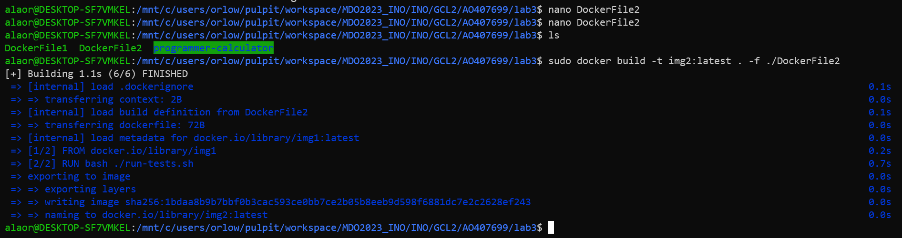
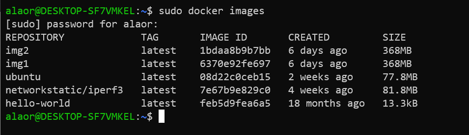
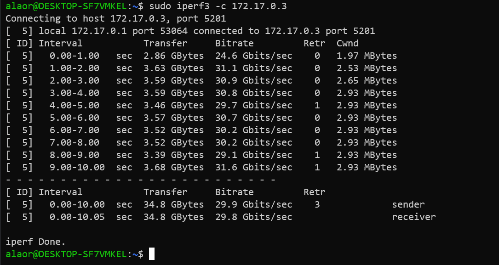

# Sprawozdanie 2 

Alicja Orłowicz

Laboratorium 3 : Docker files, kontener jako definicja etapu

Pierwszym krokiem było znalezienie repozytorium z kodem dowolnego oprogramowania, które dysponuje otwartą licencją oraz zawiera Makefile i testy. Wybrano kalkulator.

* Sklonowano wybrane repozytorium

* Doinstalowano wymagane zależności(doinstalowanie ncurses)

* Zbudowano program 

* Uruchomiono testy, a następnie program

Kolejnym krokiem było uruchomienie Dockera i sprawdzenie dostepnych obrazów

Uruchomiono kontener i podłączono się do niego celem rozpoczęcia interaktywnej pracy. Zainstalowano również gita.

Sklonowano repozytorium

Następnie uruchomiono build programu poleceniem make oraz uruchomiono testy za pomocą bash ./run-tests.sh

W drugim zadaniu należało stworzyć dwa pliki Dockerfile automatyzujące wcześniej wykonywane kroki. Pierwszy kontener przeprowadza wszystkie kroki aż do builda: 

Utworzono obraz z pliku DockerFile1 

Utworzono drugi plik Dockerfile2, w którym wybierany jest aktualny obraz utworzony wcześniej, następnie uruchamiane są testy.

Utworzenie obrazu z pliku DockerFile2:

Na końcu sprawdzono historię 

Laboratorium 4 : Dodatkowa terminologia w konteneryzacji, instancja Jenkins

**ZACHOWANIE STANU**

Przygotowano woluminy wejściowy i wyjściowy o nazwach `volin` oraz `volout`. Wykorzystano komendę `sudo docker volume create`.

 Następnie uruchomiono kontener z woluminami za pomocą `sudo docker run` i wyświetlono odpowiednie katalogi `vin` i `vout`

 

 Wyświetlono szczegóły o obu woluminach oraz ścieżkę, która będzie potrzebna w następnym kroku. Wykorzystano komendę `sudo docker volume inspect`

 

 Z poziomu roota skopiowano repozytorium na wolumin wejściowy `volin` z wykorzystaniem ścieżki z poprzedniego kroku oraz polecenia `git clone`

 

 W kontenerze widoczne jest sklonowane repozytorium

 

 Do wykonania builda w kontenerze konieczne było doinstalowanie `make`, `gcc` oraz biblioteki `ncurses`

 

 

 

 Zapisano pliki w woluminie wyjściowym

 

 **EKSPORTOWANIE PORTU**

 W następnym zadaniu pierwszym krokiem było pobranie i uruchomienie odpowiedniego obrazu dockerowego

 

 

 Sprawdzono za pomocą `sudo netstat` nasłuchiwanie serwera

 

 

 Sprawdzono IP serwera

 

 Połączono się z serwerem z drugiego kontenera, którego działanie określono jako client

 

 W celu połączenia się spoza kontenera (z i spoza hosta) najpierw zainstalowano iperf3

 

 Połączenie z hosta

 

 Połączenie spoza hosta (komputer z systemem Windows 11). Poczatkowo pobrałam Iperf3

 

 

 

 Na koniec wyciągnięto logi z kontenera aby przedstawić przepustowość komunikacji

 

 

 

 Uzyskane wyniki wskazują na to, że największą przepustowość uzyskano między kontenerami. Podobny rezultat otrzymano dla transferu między hostem a kontenerem. Wyraźnie najniższą przepustowość uzyskano dla transferu spoza hosta.

 **INSTALACJA JENKINS**

 Utworzono nową sieć dockerową oraz pobrano i uruchomiono obraz DIND kontenera

 

 Utworzono Dockerfile

 

 Zbudowano nowy obraz dockera z pliku Dockerfile określając za pomocą `-t` nazwę

 

 

 Uruchomiono stworzony obraz

 

 Sprawdzono adres localhost:8080 i odblokowano za pomocą hasła

 

* Aby odczytać hasło uruchomiono najpierw interaktywny terminal za pomocą `sudo docker exec`, polecenie `cat` pozwoliło na odczytanie już samego hasła

 

 Zainstalowano zalecane wtyczki

 

 Za pomocą polecenia `sudo docker ps` wykazano działanie kontenerów

 

 Ekran logowania 

 

 

