Alicja Orłowicz

Inżynieria Obliczeniowa

GCL2


## Pipeline, Jenkins

### PRZYGOTOWANIE 

Celem laboratorium było wykonanie czterech etapów: build, przetestowanie, deploy i opublikowanie. Pipeline utworzono do projektu https://github.com/alt-romes/programmer-calculator.
W trakcie poprzednich laboratoriów zapoznano się z dokumentacją https://www.jenkins.io/doc/book/installing/docker/. Wykonano kolejno przedstawione w niej kroki.

Zakładamy, że Jenkins jest prawidłowo zainstalowany i gotowy do działania. Zostało to zrealizowane i udokumentowane w ramach poprzedniego laboratorium.

**Uruchomienie z prawami administratora kontenerów DIND i Jenkins.**

Uruchomienie kontenera DIND. Przypisane mu zostają sieć (Jenkins), zmienne środowiskowe (za pomocą flagi env), umożliwia utworzenie kontenera w kontenerze

```bash
sudo docker run --name jenkins-docker --rm --detach \
--privileged --network jenkins --network-alias docker \
--env DOCKER_TLS_CERTDIR=/certs \
--volume jenkins-docker-certs:/certs/client \
--volume jenkins-data:/var/jenkins_home \
--publish 2376:2376 \
docker:dind --storage-driver overlay2
```
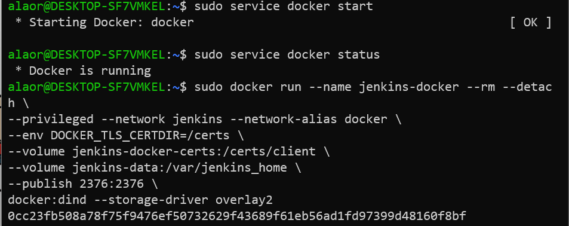

Uruchomienie kontenera Jenkins – pozwala to na zobaczenie interfejsu Jenkinsa po wpisaniu w przeglądarce `localhost:8080`, umożliwia automatyczne przeprowadzenie procesu tworzenia oprogramowania.

```bash
sudo docker run \
--name jenkins-blueocean \
--rm \
--detach \
--network jenkins \
--env DOCKER_HOST=tcp://docker:2376 \
--env DOCKER_CERT_PATH=/certs/client \
--env DOCKER_TLS_VERIFY=1 \
--publish 8080:8080 \
--publish 50000:50000 \
--volume jenkins-data:/var/jenkins_home \
--volume jenkins-docker-certs:/certs/client:ro \
myjenkins-blueocean:2.387.1-1
```
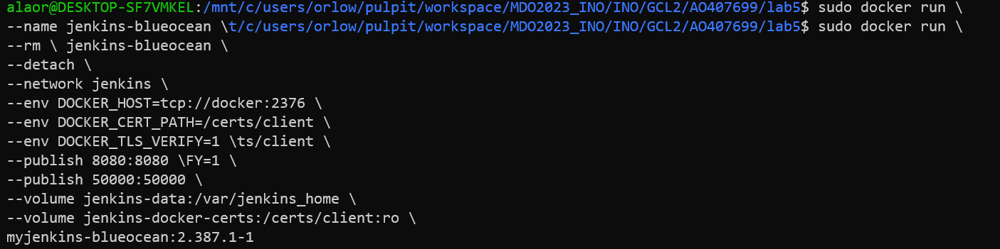

Za pomocą polecenia `sudo docker ps` upewniono się, że kontenery zostały uruchomione:

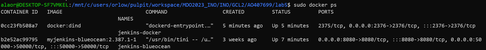

Następnie, w celu interaktywnej pracy z Jenkinsem, przechodzę do strony http://localhost:8080/
W moim przypadku konto zostało utworzone wcześniej, więc po przejściu do strony pojawia się tablica : 

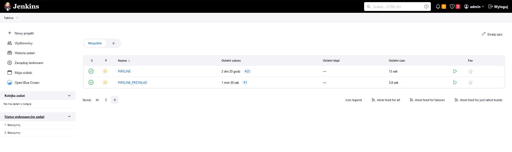

### URUCHOMIENIE

W celu zademonstrowania działania pipeline'a, stworzyłam przykladowy projekt, który zwraca informację o tym, czy godzina jest parzysta, czy nieparzysta.
W celu utworzenia nowego pipeline'a, wybrałam nowy projekt, a następnie podałam nazwę naszego pipeline'a - w moim przypadku jest to PIPELINE_PRZYKŁAD i wybrałam typ projektu jako pipeline.

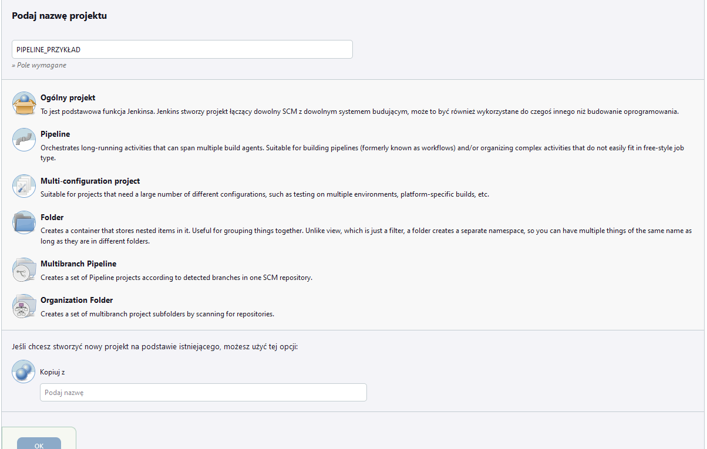

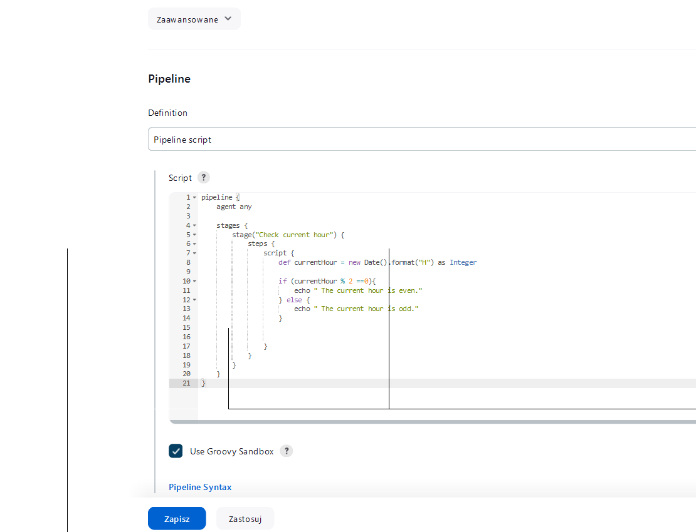


Po uruchomieniu i zbudowaniu projektu możemy zobaczyć, ze wszystko działa poprawnie. Projekt uruchomiono o godzinie 12, czyli parzystej

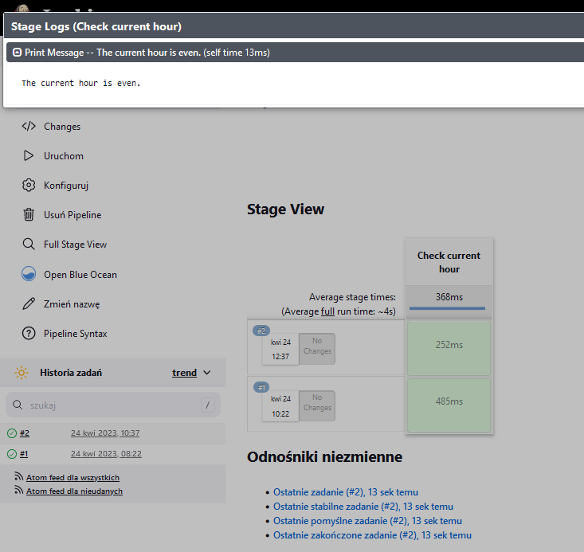

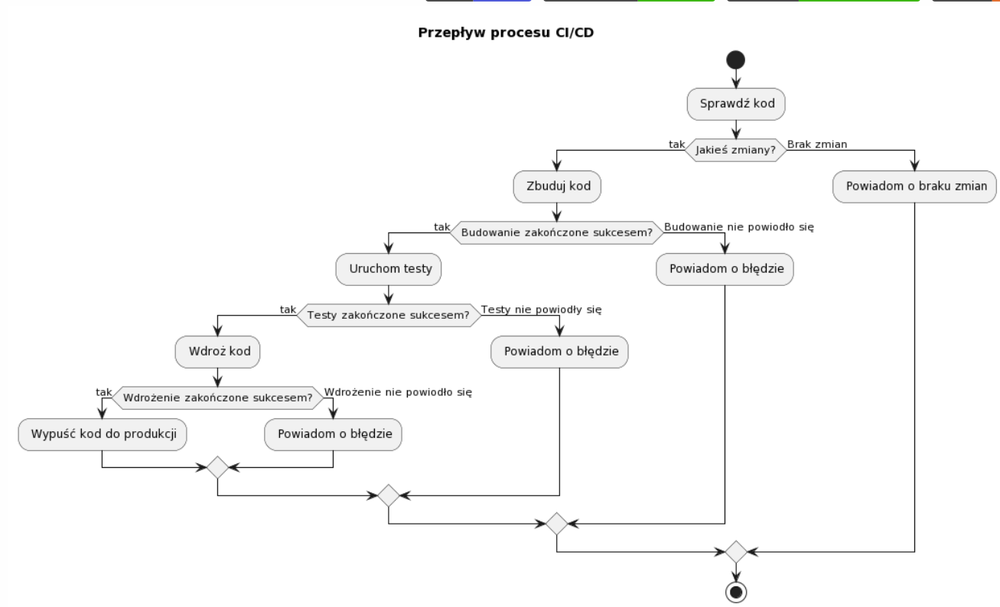

### SPRAWOZDANIE

**Przygotowanie pipeline/clone**

Stworzyłam nowy obiekt projektowy pipeline, nadałam mu nazwę `PIPELINE`.

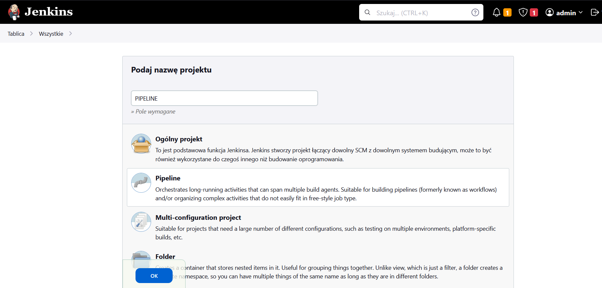

Następnie wybrano `Pipeline script from SCM` (załatwia nam clone)

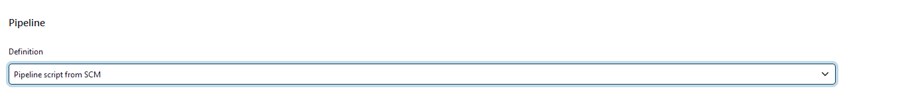

Opcja "Pipeline script from SCM"  pozwala na przechowywanie definicji pipeline w systemie kontroli wersji. Zamiast umieszczać skrypt pipeline bezpośrednio w Jenkinsie, można go umieścić w repozytorium kodu, a Jenkins będzie pobierał ten skrypt z repozytorium i uruchamiał go jako konfigurację pipeline.

Dzięki temu rozwiązaniu, zmiany w skrypcie pipeline mogą być łatwo monitorowane i zarządzane przez system kontroli wersji, co ułatwia wersjonowanie i wdrażanie zmian. Ponadto, umożliwia to współdzielenie skryptów pipeline między różnymi projektami i zespołami, co może przyspieszyć i usprawnić proces ciągłej integracji i dostarczania aplikacji.

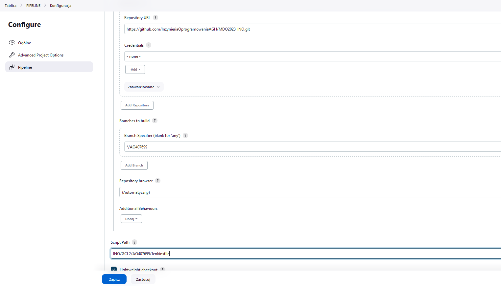


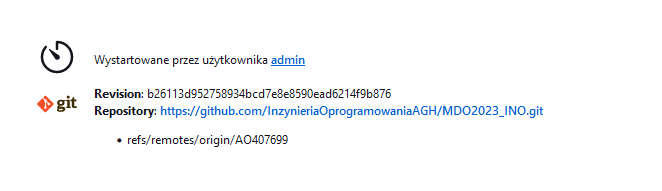

**Build**

Stworzyłam plik `DockerFile1`, w którym doinstalowywane są dependencje, a następnie kopiowane jest repozytorium wybranego projektu i odpalenie builda. Obraz jest oparty na ubuntu.

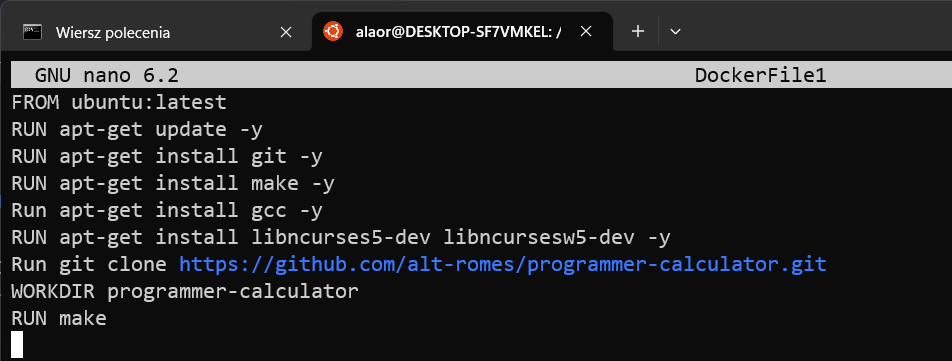

Fragment `Jenkinsfile`

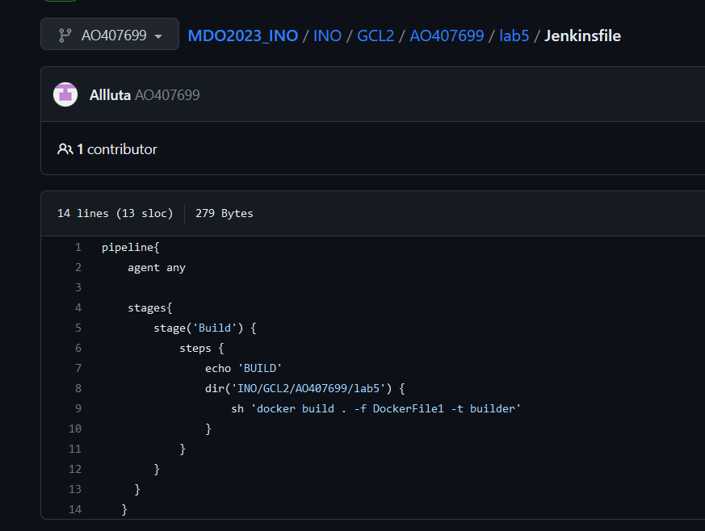

Wydruki z konsoli:

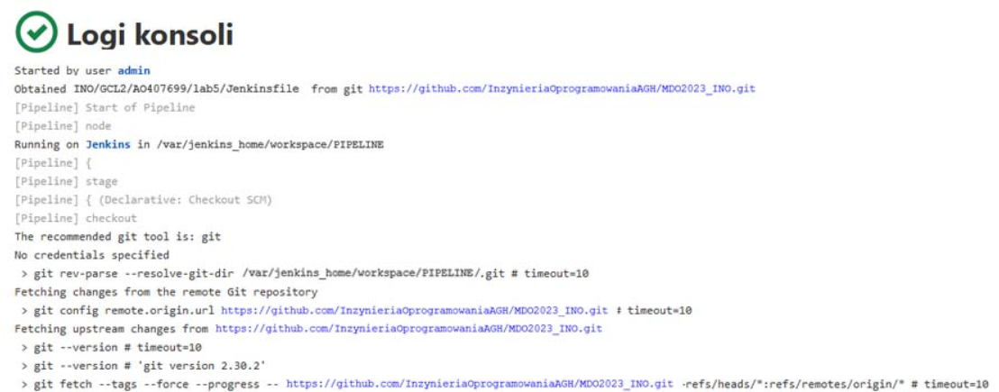

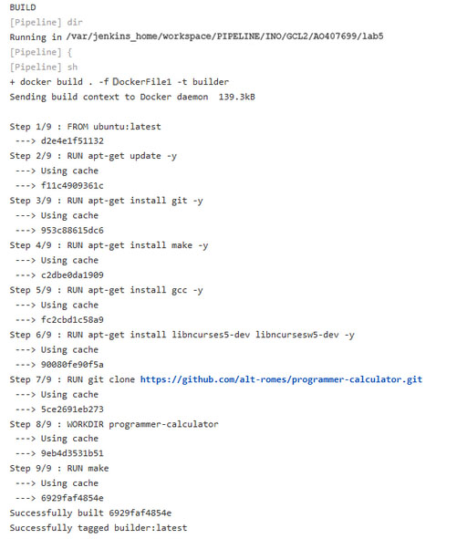

**Test**

W pliku `DockerFile2` uruchamiane są testy.

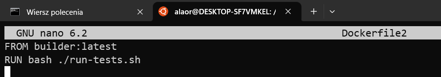

Fragment `Jenkinsfile`. Na podstawie obrazu `builder` (z poprzedniego kroku) zostaje utworzony obraz `tester`.

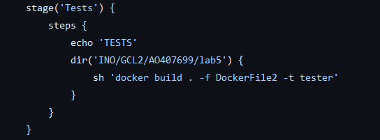

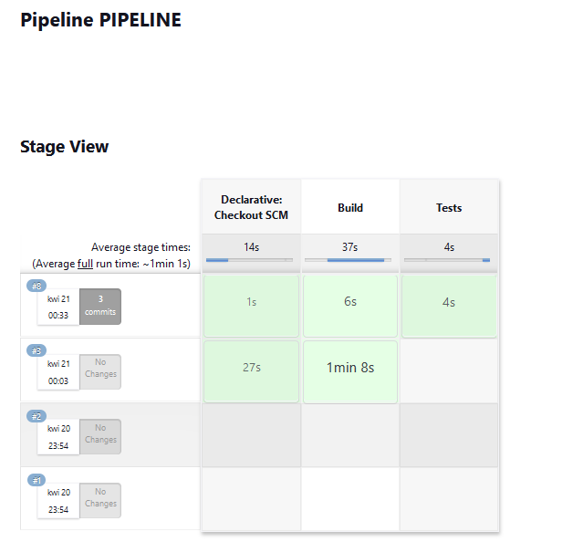

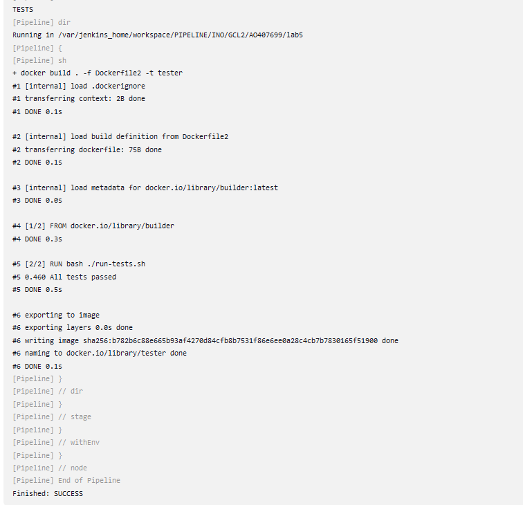


**Deploy**

`DockerFile3` - obraz `deploy` bazuje na obrazie ubuntu.

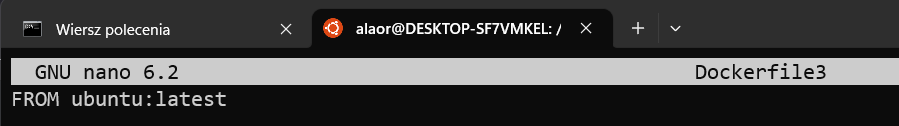

Fragment `Jenkinsfile`

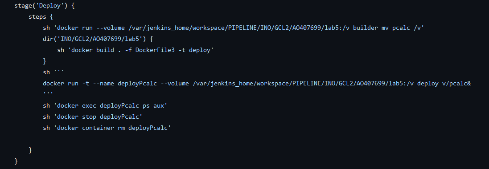

Kroki podjęte w deploy : 
 
1. Uruchomienie kontenera Docker z użyciem polecenia "docker run", w celu przeniesienia pliku wykonywalnego "pcalc" do woluminu /v.

2. Przejście do katalogu zawierającego plik Dockerfile i wykonanie polecenia "docker build", aby zbudować obraz "deploy".
 
3. Uruchomienie kontenera "deployPcalc" na podstawie obrazu "deploy", z podmontowanym woluminem /v zawierającym plik wykonywalny "pcalc".

4. Wyświetlenie listy procesów uruchomionych wewnątrz kontenera "deployPcalc", używając polecenia "docker exec".

5. Zatrzymanie kontenera "deployPcalc", używając polecenia "docker stop".

6. Usunięcie kontenera "deployPcalc", używając polecenia "docker container rm"


Wolumin /v w tym kontekście jest punktem montowania (mount point) w kontenerze Docker, który jest używany do przenoszenia pliku wykonywalnego "pcalc" oraz innych plików między hostem Jenkinsa a kontenerem Docker.
W tym przypadku, poprzez podanie "/v" jako punktu montowania, plik wykonywalny "pcalc" jest kopiowany do woluminu /v na host Jenkinsa, a następnie podmontowywany ponownie jako wolumin /v wewnątrz kontenera Docker, w celu wdrożenia aplikacji w środowisku docelowym.

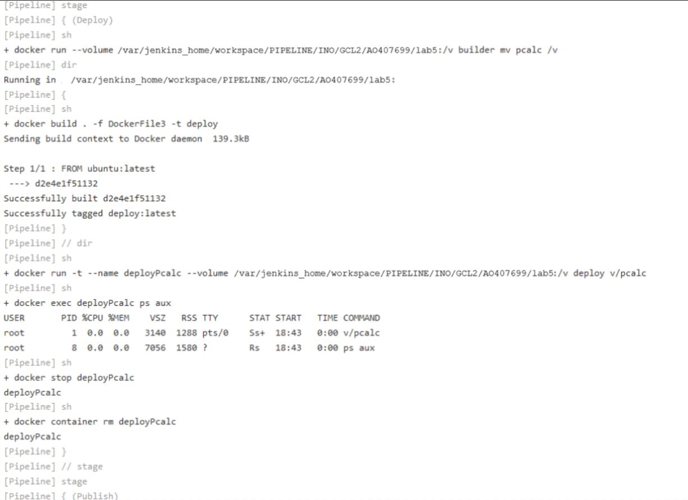

**Publish**

Jeżeli build, testy i deploy powiodą się, to publikowana jest nowa wersja programu. Do kontenera kopiowany jest jedynie plik wykonywalny.

Zawartość `DockerFile4` - wykonywalny plik `pcalc` jest pakowany do pliku tar

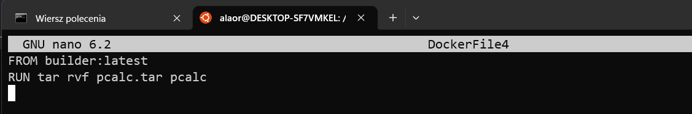

Fragment `Jenkinsfile`

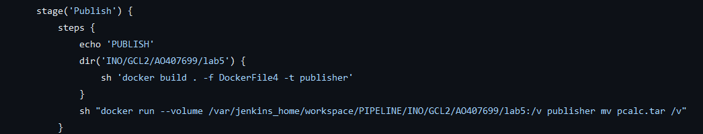

Kroki podjęte w publish :

1. Wyświetlenie komunikatu "PUBLISH" na konsoli Jenkins.

2. Przejście do katalogu zawierającego plik Dockerfile i wykonanie polecenia "docker build", aby zbudować obraz "publisher".

3. Uruchomienie kontenera Docker z użyciem polecenia "docker run", aby skopiować plik "pcalc.tar" z woluminu /v wewnątrz kontenera na wolumin /v na hostzie Jenkinsa.

Linia "sh" wykonuje polecenie "docker run", które uruchamia kontener "publisher" i używa parametru "--volume" do podmontowania woluminu /v zawierającego plik "pcalc.tar". Następnie plik "pcalc.tar" jest przenoszony z woluminu /v wewnątrz kontenera do woluminu /v na host Jenkinsa, używając polecenia "mv".

W efekcie po wykonaniu tego etapu, plik "pcalc.tar" jest dostępny na hoście Jenkinsa, co pozwala na dalsze przetwarzanie lub dystrybucję aplikacji.


**Napotkane problemy**

Problem napotkano przy etapie deploy. Początkowo program nie chciał się uruchomić – jest to program konsolowy i wymaga terminala. 

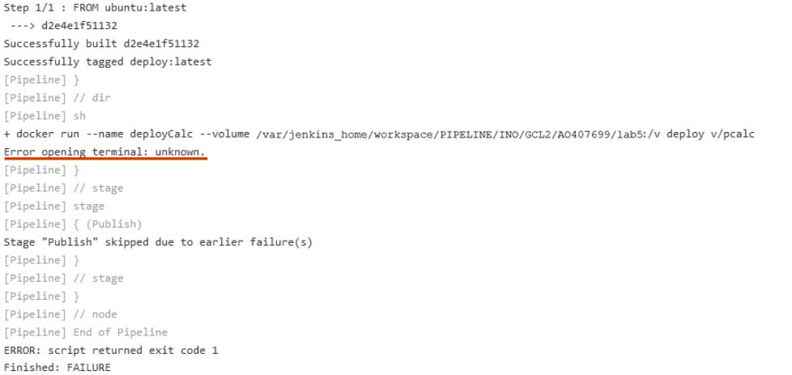

Pierwotny fragment Jenkinsfile:
```bash
stage('Deploy') {
	steps {
		sh 'docker run --volume /var/jenkins_home/workspace/PIPELINE/INO/GCL2/AO407699/lab5:/v builder mv pcalc /v'
		dir('INO/GCL2/AO407699/lab5') {
			sh 'docker build . -f DockerFile3 -t deploy'
		}
		sh '''
		docker run --name deployCalc --volume /var/jenkins_home/workspace/PIPELINE/INO/GCL2/AO407699/lab5:/v deploy v/pcalc
		'''
		sh 'docker exec deployCalc ps aux' 
		sh 'docker stop deployCalc'
		sh 'docker container rm deployCalc'
	}

```
Poprawiony fragment Jenkinsfile (dopisano parametr `-t`  oraz `&` na końcu tej samej linii – aby program działał w tle):
```bash
stage('Deploy') {
	steps {
		sh 'docker run --volume /var/jenkins_home/workspace/PIPELINE/INO/GCL2/AO407699/lab5:/v builder mv pcalc /v'
		dir('INO/GCL2/AO407699/lab5') {
			sh 'docker build . -f DockerFile3 -t deploy'
		}
		sh '''
		docker run -t --name deployPcalc --volume /var/jenkins_home/workspace/PIPELINE/INO/GCL2/AO407699/lab5:/v deploy v/pcalc&
		'''
		sh 'docker exec deployPcalc ps aux' 
		sh 'docker stop deployPcalc'
		sh 'docker container rm deployPcalc'      
	}
```

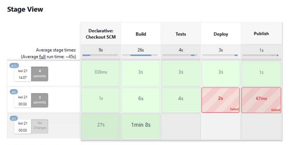

Ale jak można zauważyć, po naprawieniu blędu wszystko działa poprawnie 

Cały pipeline przedstawia się następująco:

```bash
pipeline{
    agent any

    stages{
        stage('Build') {
            steps {
                echo 'BUILD'
                dir('INO/GCL2/AO407699/lab5') {
                    sh 'docker build . -f DockerFile1 -t builder'
                }
            }
        }
        stage('Tests') {
            steps {
                echo 'TESTS'
                dir('INO/GCL2/AO407699/lab5') {
                    sh 'docker build . -f Dockerfile2 -t tester'
                }
            }
        }
        stage('Deploy') {
            steps {
                sh 'docker run --volume /var/jenkins_home/workspace/PIPELINE/INO/GCL2/AO407699/lab5:/v builder mv pcalc /v'
                dir('INO/GCL2/AO407699/lab5') {
                    sh 'docker build . -f DockerFile3 -t deploy'
                }
                sh '''
                docker run -t --name deployPcalc --volume /var/jenkins_home/workspace/PIPELINE/INO/GCL2/AO407699/lab5:/v deploy v/pcalc&
                '''
                sh 'docker exec deployPcalc ps aux' 
                sh 'docker stop deployPcalc'
                sh 'docker container rm deployPcalc'
                
            }
        }
        stage('Publish') {
            steps {
                echo 'PUBLISH'
                dir('INO/GCL2/AO407699/lab5') {
                    sh 'docker build . -f DockerFile4 -t publisher'
                }
                sh "docker run --volume /var/jenkins_home/workspace/PIPELINE/INO/GCL2/AO407699/lab5:/v publisher mv pcalc.tar /v"
            }
        }
    }
}    

```
Cel projektu został osiągnięty: proces jest skuteczny, na jego końcu powstaje możliwy do wdrożenia artefakt. W trakcie procesu publikacji artefaktu (np. aplikacji) został wygenerowany "pcalc.tar.gz", który został uznany za poprawny i ostatni z sukcesem wykonanych artefaktów. Prawdopodobnie zawierający skompresowaną aplikację lub skrypty, które zostały wygenerowane w procesie budowania, testowania i wdrażania aplikacji.

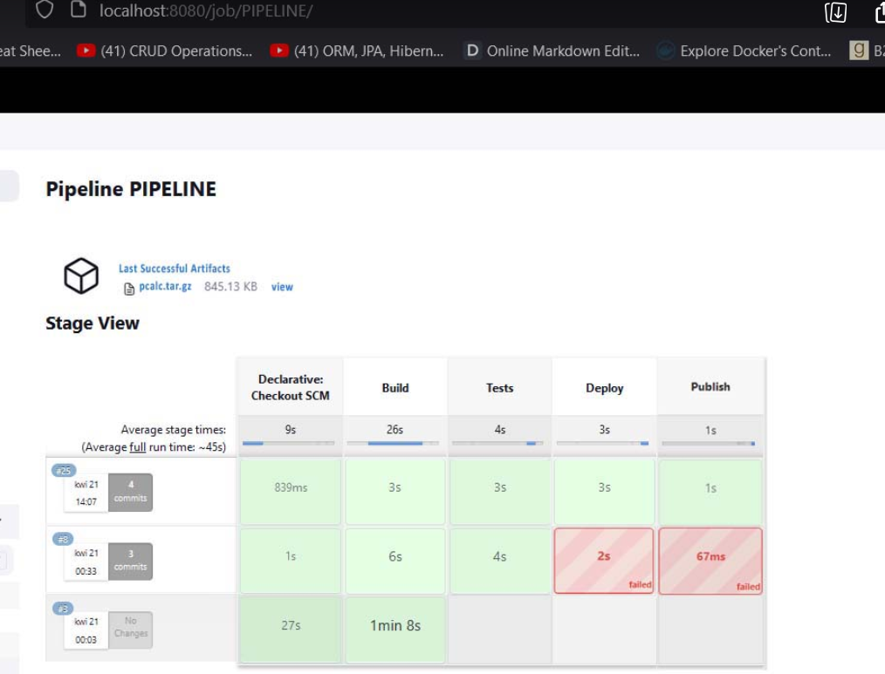


