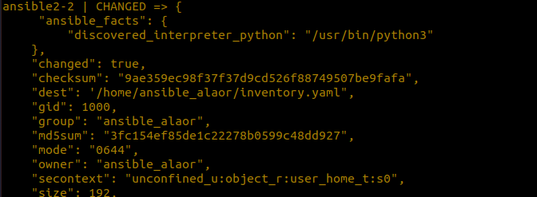

## Sprawozdanie 4

Alicja Orłowicz, 407699

Zajęcia 08

## Instalacja zarządcy Ansible
 
 Laboratorium rozpoczęłam początkowo od utworzenia drugiej maszyny wirtualnej o jak najmniejszym zbiorze zainstalowanego oprogramowania.W moim przypadku była to Fedora.

Poniżej przedstawiono kroki instalacji 


Po ponownym uruchomieniu maszyny, mogłam zalogować się przy pomocy stworzonego przeze mnie użytkownika


Następnym krokiem było zainstalowanie oprogramowania Ansible zgodnie z dokumentacją dla systemu Fedora: https://docs.ansible.com/ansible/2.9/installation_guide/intro_installation.html#installing-ansible-on-rhel-centos-or-fedora


Kolejnym etapem była inwentaryzacja systemów.
Ustawiłam przewidywalne nazwy komputerów przy pomocy sudo hostnamectl set-hostname , gdzie hostnamectl to narzędzie wiersza poleceń w Linux OS, które umożliwia zarządzanie nazwą hosta systemu - dzięki niemu można ustawić nazwę hosta.


Aby umożliwić wywoływanie komputerów za pomocą nazw zamiast adresów IP, wprowadziłam nazwy DNS dla maszyn wirtualnych, korzystając z systemd-resolved. W tym celu dokonałam edycji dwóch plików /etc/hosts oraz /etc/systemd/resolved.conf. Musiałam użyć polecenia "sudo" w celu uzyskania uprawnień administratora, inaczej pojawiał się błąd związany z brakiem uprawnień do edycji pliku.


Następnie zrestartowałam usługę systemd-resolved przy użyciu polecenia sudo systemctl restart systemd-resolved.
Zweryfikowałam łączność za pomocą komendy ping i nazwy hosta. Weryfikacja łączności przebiegła pomyślnie.


W celu uzyskania łączności między maszynami wygenerowałam klucz i wymieniłam go pomiędzy maszynami oraz wykonałam próbę logowania przy użyciu SSH - zostałam zalogowana bez użycia hasła, co pokazuje prawidłowość wykonania tego kroku:


Następnie wyświetliłam listę dostępnych hostów.


Wysłałam moduł ping do wszystkich dostępnych hostów:


Wszystko przebiegło poprawnie i zgodnie z przewidywaniem - jedynie ansiblehost jest nieosiągalny, ze względu na to, że moduł ping nie działa tak jak zwykły ping - wymaga wymiany kluczy, a nie wymieniamy swojego klucza z samym sobą

Następnie stworzyłam plik inwentaryzacji. Jego efekt działania powinien być z założenia podobny do uzyskanego poprzednio.

Zawartość pliku :


Zweryfikowałam inventory, zgodnie z dokumentacją https://docs.ansible.com/ansible/latest/getting_started/get_started_inventory.html:


Uruchomiłam moduł ping przy użyciu pliku inventory.yaml.
Jak widzimy, rezultat działania jest taki jak omówiony poprzednio, powyższe kroki zostały wykonane poprawnie.


Zmodyfikowałam mój stary plik inwentaryzacji. Umieściłam w nim sekcje Orchestrators oraz Endpoints. Plik po edycji przedstawia się następująco:


## Zdalne wywoływanie procedur

Teraz pingując wszystkie maszyny, wystarczy, że spinguję moje endpointy (w tej sekcji nie ma obecnego hosta, więc maszyny są dwie i wszystko przebiega poprawnie):


Skopiowanie pliku inwentaryzacji na maszynę endpoint, następnie wykonanie tej samej komendy w celu sprawdzenia czy plik został zmieniony.




Następnie sprawdziłam, czy plik został skopiowany poprawnie na oba endpointy:


Ponowiłam operację - tym razem  zamiast statusu CHANGED uzyskałam SUCCESS.


Próba wykonania powyższej komendy przy wyłączonym internecie oraz usłudze ssh


Sprawdziłam też status sshd, aby upewnić się, że usługa została pomyślnie zdeaktywowana. Następnie wykonałam ping, tym razem endpoint z wyłączonym SSH jest UNREACHABLE:


Aby ping znowu zadziałał poprawnie, pomimo wyłączonej usługi SSH na jednym z endpointów, konieczna była edycja pliku konfiguracyjnego ansible. Znalazłam jego lokalizację za pomocą zapytania o wersję:


Dopisałam do niego następujące linijki:


Teraz ping obu endpointów przebiegł pomyślnie:


## Zarządzanie kontenerem

Stworzyłam plik playbook.yaml zawierający kroki budujące kontenera. 

```bash
- name: Deploy application in Docker container 
  hosts: endpoints 
  become: yes 
  become _method: sudo 
  tasks:
    - name: Install docker 
      become: yes 
      pip:
        name:
           - websocket-client==0.59.0
           - requests==2.28.2
           - urllib3==1.26.15
           - docker
           - docker-compose 
        state: present
    - name: First test
      shell: docker ps 
    - name: Build application 
      docker_image:
        source: build 
        build:
          path: /home/alaor/dockerfiles 
        name: app
    - name: Run container  
      docker_container:
        name: app_container 
        image: app
```
Wersja z obrazem z DockerHub:

```bash
- name: Deploy application in Docker container 
  hosts: endpoints 
  become: yes 
  become _method: sudo 
  tasks:
    - name: Install docker 
      become: yes 
      pip:
        name:
           - websocket-client==0.59.0
           - requests==2.28.2
           - urllib3==1.26.15
           - docker
           - docker-compose 
        state: present
    - name: First test
      shell: docker ps 
    - name: Build application 
      docker_image:
        source: pull
        name: alaor/moja_aplikacja
    - name: Volume
        name: volume
    - name: Run docker container  
      docker_container:
        name: app
        image: alaor/moja_aplikacja
        intercative: true
        ports:
          - "8081:8081"
        volumes:
          - /volume
```

Niestety ze względu na problemy systemowe nie byłam w stanie uzyskać poprawnych rezultatów tego kroku. 


 ## Instalacja nienadzorowana systemu

Aby przeprowadzić instalację nienadzorowaną, musiałam skopiować plik odpowiedzi o nazwie /root/anaconda-ks.cfg. Ten plik był potrzebny do skonfigurowania instalacji. Jednak, z powodu ograniczeń dotyczących uprawnień, nie mogłam bezpośrednio skopiować pliku z folderu /root. W celu rozwiązania tego problemu, skorzystałam z wcześniej utworzonej maszyny. Z tej maszyny mogłam uzyskać dostęp do pliku odpowiedzi. Następnie skopiowałam ten plik z maszyny do docelowej lokalizacji na innym urządzeniu, aby umożliwić instalację nienadzorowaną. W rezultacie, mogłam pomyślnie skopiować plik odpowiedzi /root/anaconda-ks.cfg.


Dzięki temu kopiowanie przebiegło już w sposób zgodny z przewidywaniem,a plik wrzuciłam do mojego folderu na repozytorium Github. Jego zawartość przedstawia się następująco:

```bash
# Generated by Anaconda 37.12.6
# Generated by pykickstart v3.41
#version=DEVEL
# Use graphical install
graphical

# Keyboard layouts
keyboard --vckeymap=pl --xlayouts='pl'
# System language
lang pl_PL.UTF-8

%packages
@^minimal-environment
@editors
@headless-management
@network-server

%end

# Run the Setup Agent on first boot
firstboot --enable

# Generated using Blivet version 3.5.0
ignoredisk --only-use=sda
autopart
# Partition clearing information
clearpart --none --initlabel

timesource --ntp-disable
# System timezone
timezone America/New_York --utc

# Root password
rootpw --iscrypted --allow-ssh $y$j9T$49G7rjzpQf91/eBmO3NJJsrg$hTWbkq65.cT9leUTsUdO3o6OgDD0NIizbf7FQffeXy.
user --groups=wheel --name=ansible_alaor --password=$y$j9T$HiwFt4cyn/64AzGKPExp3y9G$/Z528z3jwAUTvE6Jf6IbRN98vibYpsnbFG.TN5PqD69 --iscrypted --gecos="ansible_alaor"
```
dodanie do pliku anaconda-ks.cfg fragmentu :

```bash
url --mirrorlist=http://mirrors.fedoraproject.org/mirrorlist?repo=fedora-37&arch=x86_64
repo --name=updates --mirrorlist=http://mirrors.fedoraproject.org/mirrorlist?repo=updates-released-f37&arch=x86_64
```
Utworzyłam nową maszynę wirtualną z systemem Fedora.


Aby potwierdzić, czy instalacja przebiegła pomyślnie na nowo utworzonej maszynie sprawdzam działające kontenery


Wnioski :
Ansible okazał się być przydatnym narzędziem, które znacząco ułatwia operacje między dwoma komputerami.Dzięki Ansible możemy zdefiniować zestaw instrukcji i skryptów w pliku konfiguracyjnym, który automatycznie wykonuje wszystkie niezbędne operacje.Ansible umożliwia replikację i skalowanie zadań na wiele maszyn jednocześnie, co czyni go niezwykle przydatnym narzędziem w środowiskach, w których konieczne jest zarządzanie infrastrukturą wielu serwerów.
